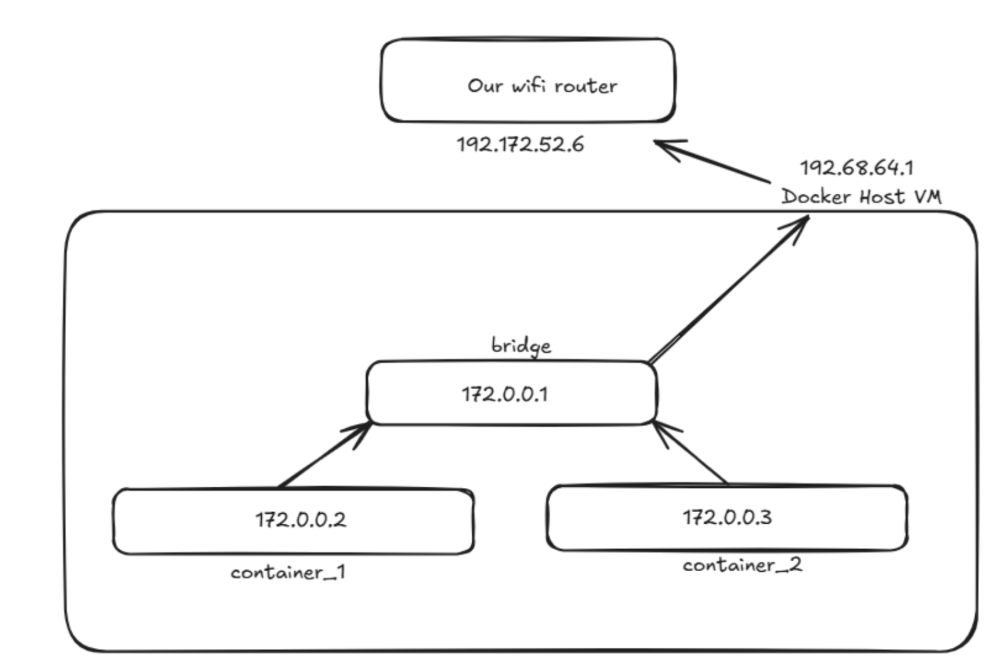

# Understanding Proxy, Reverse Proxy, NGINX, Networking

### What is a Proxy or Forward Proxy?
> It is like a middleman which sits between client and server. It is a server which passes requests to the actual backend servers on behalf of clients.

> For example:
>> When you request https://example.com (just an example), instead of sending the request directly to the website, your browser sends it to the proxy server.
>> The proxy server forwards the request to the website on your behalf, then passes the response to you. 
>> **An example of Proxy is VPN.**

#### Key Points:
1. The destination server sees the request as coming from the proxy, not from your computer.
2. Your identity (client IP) is hidden.


### What is a Reverse Proxy?
> A reverse proxy sits infront of servers, acting as a single entry point for clients. NGINX is a great example of reverse proxy.
* When a client requests, for example: https://myapp.com, it hits the reverse proxy first.
* The reverse proxy decides which backend server should handle the request.
* The client never sees the actual servers - it only knows about the reverse proxy.

#### Key Points:
1. The client doesn't know how many servers exist or their addresses.
2. The reverse proxy can:
    * Load balance requests across multiple servers.
    * Cache responses to improve performance.
    * Add security by hiding backend server's IP and handling SSL/TLS.
    * Terminate SSL (do encryption/decryption at the proxy instead of backend).


**So in simple terms, we can say that, the Forward Proxy hides client identity and Reverse Proxy hides Server/s identity.**

### NGINX
Nginx is a reverse proxy, written in C language. It is designed to handle many thousands of connections with very little CPU and memory. It does this by using event-driven, asynchronous, non-blocking architecture.
> NGINX has three main processes:
* Master Process.
* Worker Processes.
* Helper Processes (Optional, like cache manager).

#### Master Process
* When NGINX starts, the master process is created first.
* Responsibilities:
    * Reads and validates the configuration file (nginx.conf)
    * Opens listening sockets (e.g., port 80, 443)
    * Spawns worker processes.
    * Handles signals (reload, stop, restart) and passes them to workers. 
    * Note: The master itself does not handle the traffic. It's mainly a manager.

#### Worker Processes
* These are the real workhorses.
* Each worker:
    * Accepts new connectios.
    * Reads/Writes requests/responses.
    * Handles proxying, caching, SSL/TLS, compression, etc.
* How workers are created:
    * We configure in nginx.conf, how many workers you want (worker_processes)
    * **Usually set to the number of CPU cores.**
    * Example: **worker_processes auto;**
* How workers handle traffic:
    * Each worker is single threaded but uses an event loop.
    * Instead of creating one thread per connection, it uses epoll(Linux) or kqueue(BSD/macOS) -- system calls that efficiently tells NGINX which sockets have new data.
    * This way, each worker can handle thousands of connections simultaneously without blocking.
* Inside a worker: The worker follows a cycle:
    * Accept: Wait for new connections on listening socket.
    * Read: Parse request line, headers, body.
    * Process: Apply rules (routing, reverse proxy, cache, filters)
    * Write (send back response)
    * Close or reuse.

#### Connection handling in detail
When a client connects:
* The Kernel notifies NGINX (via epoll/kqueue).
* One worker accepts the connection.
* The worker reads data into memory buffers (non-blocking).
* Modules are applied (HTTP parser, SSL handler, proxy module, gzip, etc).
* Response is written back in chunks (non-blocking).
* The worker goes back to the event loop to check other sockets.

#### Why is this design efficient?
* Event-driven: Workers never make CPU waiting; they respond only when the OS says a socket is ready.
* Single-threaded workers: no context-switching overhead between threads.
* Multiple workers: parallel use of CPU cores.
* No per-connection thread: uses very little memory even with 10k+ connections. 


### Layer-4 and Layer-7 Balancing
> Layer 4/7 refers to the **OSI** model layers.
>> When we say layer 4 balancing, we mean: balancing requests based on the information available at the transport layer.

>> When we say layer 7 balancing, we mean: balancing based on the application layer details.

#### More on Layer-4 Balancing
* In Layer 4, we see the TCP/IP stack only, nothing about the app, we have access to: Source IP, Source Port, Destination IP, Destination Port.
* NGINX looks only at IP addresses and ports.
* It doesn't know or care if the traffic is HTTP, HTTPs, FTP, or anyhting else.
* It just forwards raw network packets to the right server.


#### More on Layer-7 Balancing
* At layer 7, we see the application. We have access to more context.
* We know where the client is going, which page they are visiting.
* Requires decryption.
* NGINX looks inside the request.
* It understands HTTP/HTTPs (or other application layer protocols).
* Can make smarter decisions based on:
    * URL paths (/api vs /images)
    * HTTP headers (e.g., User-Agent, Cookies)
    * Request Header (GET vs POST)


#### TLS Termination
* "Termination" means, NGINX ends the TLS connection from the client.
* The client does the TLS handshake with NGINX (not directly with your backend server).
* NGINX uses the server's private key and certificates to decrypt the traffic. Once decrypted, NGINX can see the HTTP request (URL, headers, etc), so it can do Layer 7 load balancing or other processing.
* After that, NGINX either:
    * Sends the request in plain HTTP to the backend (common in private networks) or
    * Starts a new TLS session with the backend (called re-encryption).
* NGINX has the full visibility of the traffic because it decrypts it.

#### TLS Passthrough:
* In passthrough mode, NGINX does not terminate TLS.
* The TLS handshake happens directly between the client and the backend server.
* NGINX just forwards encrypted bytes to the backend server.
* Since NGINX never decrypts, it cannot see HTTP headers, paths, or methods. It can only balance at layer 4 (IP + Port).
* NGINX cannot do content-based routing here.

### Using NGINX as Load Balancer.
> I am not going to install NGINX locally, rather I will be using **Docker** to spin up a nginx container.

We are going to create a simple server using node, express which will have only one end point ('/') and it returns hostname. We will spin up three containers for our node js server and a nginx container to load balance among the 3 servers. Please refer below code for that:
```
const express = require("express");
const os = require("os");
const app = express();

const hostName = os.hostname();

app.get("/", (req, res) => {
    res.send("Hello from: " + hostName);
})

app.listen(3000, () => {
    console.log("Server is listening on port 3000");
});
```

Now create a Dockerfile as below:
```
FROM node:20
WORKDIR /home/node/app
COPY app/ .
RUN npm install
CMD node server.js
```

Refer below for the project structure:


Now, we have our docker file ready, use below commands to create an image and then spin up three containers:
```
// creating the docker image named nodeapp
docker build . -t nodeapp

// spin up 3 containers (container names: nodeapp1, nodeapp2, nodeapp3) (hostnames: same as container names)
docker run --name nodeapp1 --hostname nodeapp1 -d nodeapp
docker run --name nodeapp2 --hostname nodeapp2 -d nodeapp
docker run --name nodeapp3 --hostname nodeapp3 -d nodeapp
```

Now we need to create nginx.conf (configuration) file and write the rule to load balance the traffic among above 3 containers. So create a nginx.conf (we are kind of overwriting default nginx.conf file using docker volumes):
```
http {
    upstream nodebackend {
        server nodeapp1:3000;
        server nodeapp2:3000;
        server nodeapp3:3000;
    }
    server {
        listen 8080;
        location / {
            proxy_pass http://nodebackend/;
        }
    }
}

events {}
```

Now to run the nginx container:
```
docker run --name nginx --hostname ng1 -p 80:8080 -v ${PWD}\nginx.conf:/etc/nginx/nginx.conf -d nginx

```

**But here we have an issue**
> We are using hostnames (nodeapp1, nodeapp2, nodeapp3) in nginx.conf file, but nginx container will not be able to understand these hostnames (Resolve hostname to ip). If we use IP address instead of hostnames, it will work fine. But using hostname is simple and meaningful, so how to handle this issue. Just for a recap of what we have done (or trying to do so far):

Note: Our node apps are running on port 3000 (but in image it is shown as 8080, please ignore, it should be 3000).

We will come at this issue later, let's understand a bit of Docker networking.

#### Docker Networking
Suppose I spin up two containers from the same image (hostnames are: s1 and s2 and IP address are 10.0.0.2 and 10.0.0.3 let's say). Now I exec into container s1 and do **ping s2, it will not work**. But if I do **ping 10.0.0.3, it will work**. 

When we spin up containers, they are all part of default bridge network of docker and for bridge network the DNS resolver is same as the DNS resolver of our host. If from s1, you do ping google.com, it will work because the request goes to the DNS resolver of out host (which is usually our ISP). But if you do ping s2, then request goes to host DNS resolver, but s2 is completely inside docker network and is unknown to the outside world.


So, to be able to use hostnames, we can create our own docker network and attach containers to that network. In user-created network, the DNS resolver is the network it self and it can convert hostnames to IP addresses. Use below commands:
```
// to see all docker networks
docker network ls

// to create a network (network name: backendnet)
docker network create backendnet

// to add containers to the network
docker network connect backendnet nodeapp1
docker network connect backendnet nodeapp2
docker network connect backendnet nodeapp3

// to get more info about a network
docker network inspect network_name
```

Now we have added all our node app containers to the backendnet network. Now just start the nginx container (we started previously, but it must have exited because hostnames were not reachable).
```
docker start nginx
```

Now, open the browser and hit: localhost:80 multiple times, you will see the hostname keeps on changing like: nodeapp1, nodeapp2, nodeapp3, nodeapp1, nodeapp2...
